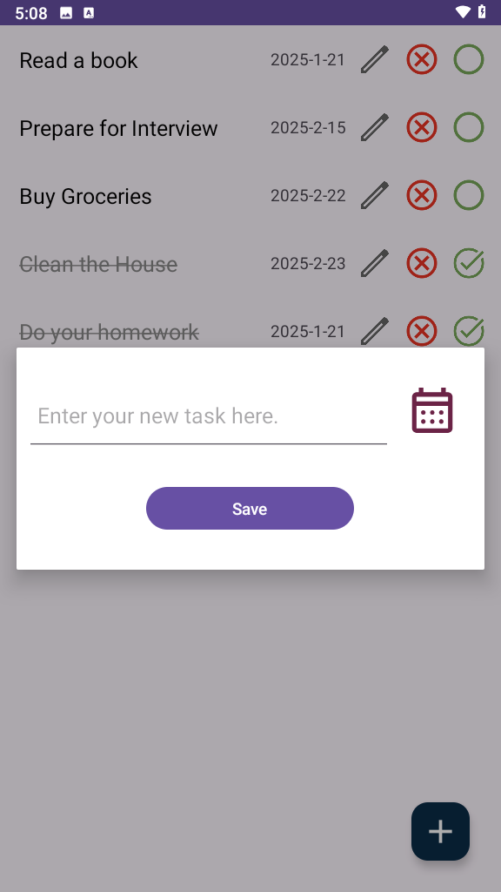
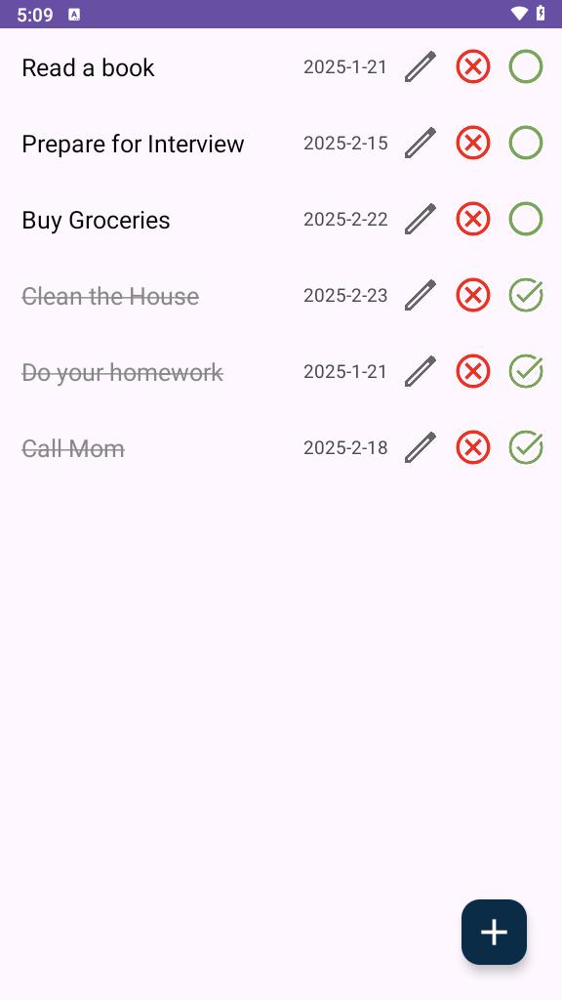

# To-Do List App

## Introduction
This is a simple **To-Do List** app built with **Java** and **Android Studio**.
It allows users to add, edit, delete, and mark tasks as completed.
The app stores tasks locally using **SQLite** for persistent data storage.

## Features
- Add new tasks.
- Edit or delete existing tasks.
- Mark tasks as completed.
- Store tasks locally using SQLite.

## Installation
1. Clone the repository:
    ```bash
    git clone https://github.com/homa-mh/ToDo-list-android-app.git
    ```
2. Open the project in **Android Studio**.
3. Build and run the app on an emulator or a physical device.

## Technologies Used
- **Java**
- **Android Studio**
- **SQLite** for local data storage
- **RecyclerView** for displaying tasks in a list

## Screenshots



## License
MIT License / All rights reserved
